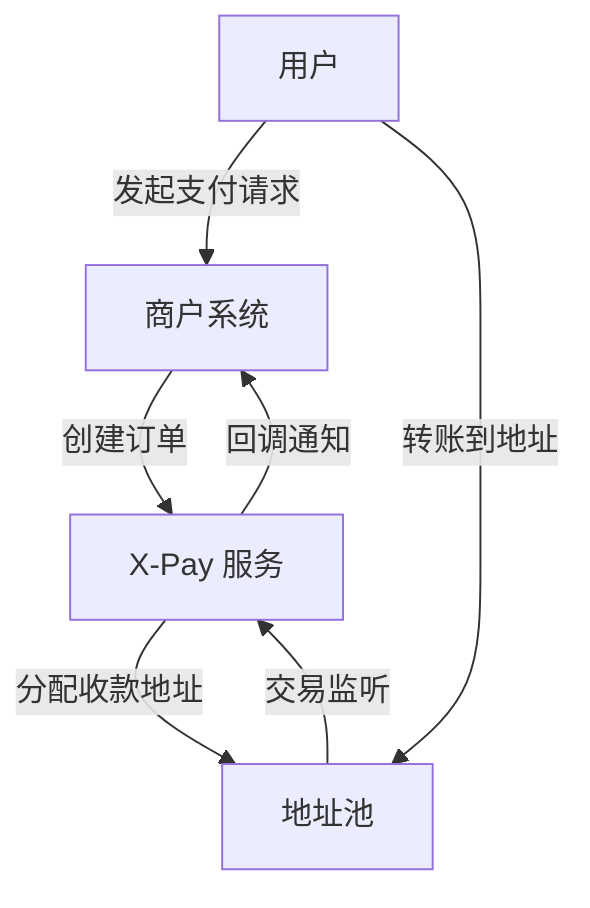

# 🌐 X-Pay — 下一代通用加密货币支付系统

[X-Pay](https://www.x-pay.fun/) 是一个开源的 **多链加密货币支付系统**，为商户、开发者和 Web3 应用提供安全、可扩展且易集成的加密货币收款解决方案。

## 🚀 项目特色

- **多链多币种支持**：已支持 **TRON (TRC-20 USDT)**，后续计划支持 ETH、BSC 等主流链。  
- **统一架构设计**：通用表结构、模块化设计，便于扩展新币种与新链。  
- **自动归集**：地址池管理 + 助记词派生，支持资金自动归集与管理。  
- **实时监听**：基于 TronGrid / Web3 RPC 的地址与交易监听，订单状态及时回调。  
- **开发者友好**：提供 RESTful API 与多语言 SDK（Java / Node.js / 前端 SDK），后端基于 Spring Boot + MyBatis Plus。

## 📦 技术栈

- 后端：Spring Boot 3、MyBatis Plus、RxJava、Web3j、Tron Java SDK  
- 前端：Vue 3（Tailwind）、示例部署到 Cloudflare Pages  
- 数据库：MySQL

## 🏗 架构示意



## 🔧 快速开始

1. 克隆主仓库（示例）：
```bash
git clone https://github.com/x-pay-official/x-pay.git
cd x-pay
```

2. 编辑配置文件（数据库、链节点、API Key 等）  
3. 启动服务：
```bash
./mvnw spring-boot:run
```

4. 访问管理后台或通过 API 创建订单并测试支付回调。

## 📎 相关仓库
- x-pay-java-sdk — Java SDK  
- x-pay-node-sdk — Node.js SDK  
- x-pay-vue-demo — 前端示例（Vue）  
- x-pay-react-demo — 前端示例（React）  

## 📌 Roadmap
- [ ] 支持 ETH / BSC USDT  
- [ ] 自动归集模块完善与上线  
- [ ] 多商户 SaaS 化支持  
- [ ] 增加 Webhooks 签名校验与防重放机制

## 🤝 贡献
欢迎提交 PR、Issue，或在 Discussions 里提出功能建议与集成问题。请遵循贡献指南（CONTRIBUTING.md）。

## 🔗 链接
- 官网: https://www.x-pay.fun/  
- 组织 / 代码: https://github.com/x-pay-official
