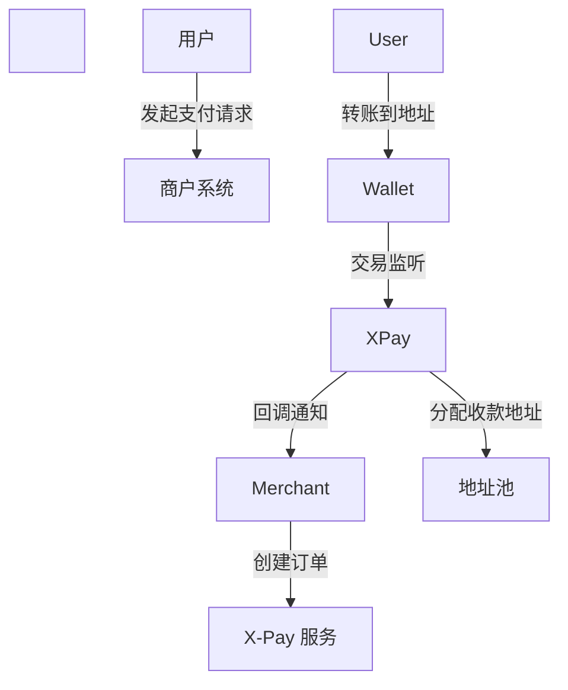

\# 🌐 X-Pay 中文文档


\[X-Pay](https://www.x-pay.fun/) 是一个开源的 \*\*多链加密货币支付系统\*\*，为商户、开发者和 Web3 应用提供安全、可扩展且易集成的支付解决方案。


\## 🚀 项目特色

\- \*\*多链多币种支持\*\*：已支持 TRON (TRC-20 USDT)，后续计划支持 ETH、BSC 等。  

\- \*\*统一架构设计\*\*：通用表结构、模块化设计，便于扩展新币种和链。  

\- \*\*自动归集\*\*：地址池管理 + 助记词派生，支持资金自动归集。  

\- \*\*实时监听\*\*：TronGrid / Web3 RPC 地址监听，订单状态秒级回调。  

\- \*\*开发者友好\*\*：RESTful API + SDK（Java / Node.js / 前端），后端基于 Spring Boot + MyBatis Plus。


\## 📦 技术栈

\- 后端：Spring Boot 3、MyBatis Plus、RxJava、Web3j、Tron Java SDK  

\- 前端：Vue 3 (Tailwind)，部署在 Cloudflare Pages  

\- 数据库：MySQL


\## 🔧 快速开始

1\. 克隆主仓库：

```bash

git clone https://github.com/x-pay-official/x-pay.git

cd x-pay

```

2\. 配置数据库、链节点、API Key  

3\. 启动服务：

```bash

./mvnw spring-boot:run

```


\## 🏗 架构示意




\## 📎 相关仓库

\- x-pay-java-sdk — Java SDK  

\- x-pay-node-sdk — Node.js SDK  

\- x-pay-vue-demo — Vue 前端示例  

\- x-pay-react-demo — React 前端示例


\## 📌 Roadmap

\- 支持 ETH / BSC USDT  

\- 自动归集模块上线  

\- 多商户 SaaS 化  

\- Webhook 签名校验与防重放机制


\## 🤝 贡献

欢迎提交 PR 或 Issue，请遵循 CONTRIBUTING.md 指南。


\## 🔗 链接

\- 官网: https://www.x-pay.fun/  

\- GitHub: https://github.com/x-pay-official


