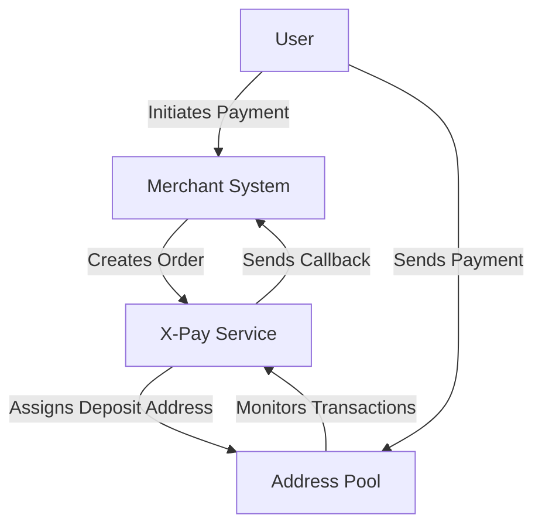

# 🌐 X-Pay — Next-Generation Universal Crypto Payment System

[X-Pay](https://www.x-pay.fun/) is an open-source **multi-chain cryptocurrency payment system** designed to provide secure, scalable, and developer-friendly payment solutions for merchants, developers, and Web3 applications.

## 🚀 Key Features

- **Multi-chain & Multi-token Support**: Currently supports **TRON (TRC-20 USDT)**, with planned support for ETH, BSC, and other major chains.  
- **Unified Architecture**: Generalized table structure and modular design for easy extension to new chains and tokens.  
- **Automatic Fund Collection**: Address pool management + mnemonic-based address derivation with automated fund consolidation.  
- **Real-time Monitoring**: Transaction and address monitoring via TronGrid / Web3 RPC, with instant order status callbacks.  
- **Developer Friendly**: RESTful API & SDKs (Java, Node.js, Frontend), backend built with Spring Boot + MyBatis Plus.

## 📦 Tech Stack

- **Backend**: Spring Boot 3, MyBatis Plus, RxJava, Web3j, Tron Java SDK  
- **Frontend**: Vue 3 (Tailwind), deployed with Cloudflare Pages  
- **Database**: MySQL

## 🏗 Architecture Overview



## 🔧 Getting Started

1. Clone the repository:
```bash
git clone https://github.com/x-pay-official/x-pay.git
cd x-pay
```

2. Configure your environment (database, blockchain RPC, API keys, etc.)  
3. Start the service:
```bash
./mvnw spring-boot:run
```

4. Access the dashboard or use the API to create test orders and validate callbacks.

## 📎 Related Repositories
- x-pay-java-sdk — Java SDK  
- x-pay-node-sdk — Node.js SDK  
- x-pay-vue-demo — Vue frontend demo  
- x-pay-react-demo — React frontend demo  

(Replace the above with actual repository links or submodules as appropriate)

## 📌 Roadmap (Sample)
- [ ] Support ETH / BSC USDT  
- [ ] Launch enhanced auto-collection module  
- [ ] Multi-tenant SaaS support  
- [ ] Add webhook signature verification & replay protection

## 🤝 Contributing
Contributions are welcome via PRs or Issues. Please check the contribution guidelines (CONTRIBUTING.md).

## 🔗 Links
- Website: https://www.x-pay.fun/  
- GitHub Org: https://github.com/x-pay-official
